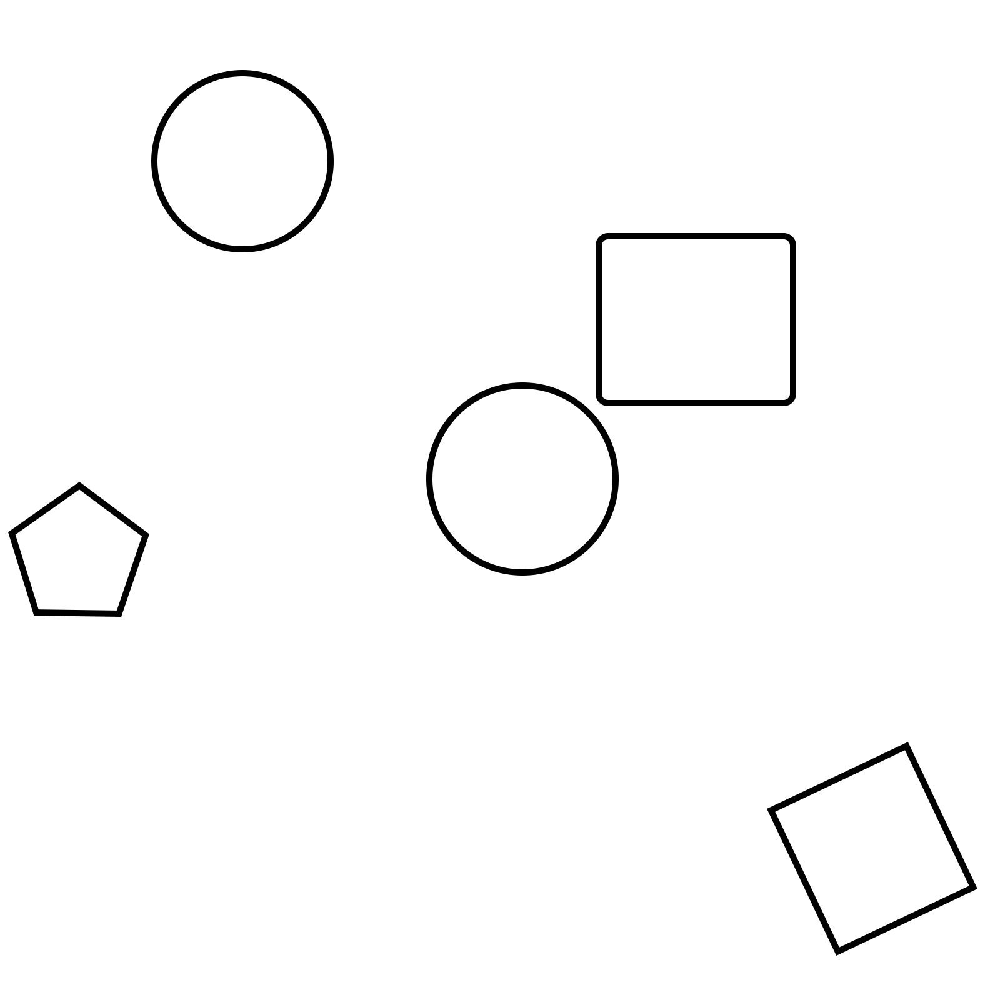
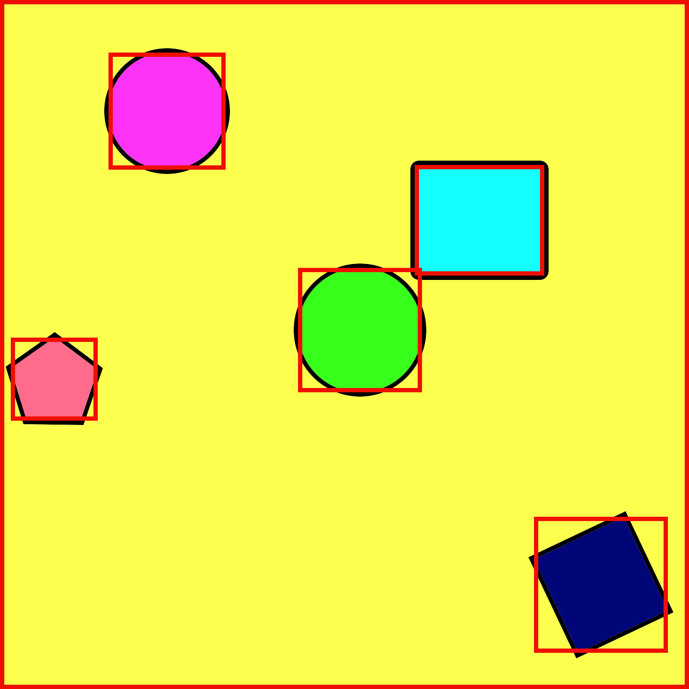

  

# LFColoringBook
An iOS/UIKit/CoreGraphics/Swift implementation of a Coloring Book app

This is a simple coloring book motor created during a week of boredom trying to reverse engineer drawing apps out there

It works in two modes: A naive and an optimized mode

Both methods make use of the [Flood Fill](https://en.wikipedia.org/wiki/Flood_fill) approach  to create a "mask" of the proper area to draw into

The naive, unoptimized approach doesn't need any heavy preloading at the cost of performance by calculating the mask at the start of each drawing stroke. Since Flood Fill is computationally expensive it doesn't guarantees a mask will be created on time when the user crosses a line boundary 

The optimized approach on the other hand takes some time to preload, and consumes a little bit of more memory, but since masks are calculated from the start they can be retrieved fairly fast at the beginning of a stroke

## How Does it Work

### The clipping mask detection

The naive approach is pretty straight forward. At the start of each stroke a mask is generated using Flood Fill

With the optimized approach an image is analyzed first

Let's say we start with an image like this one

We loop through all pixels off the image that are not fully black. In that place we create a mask, and continue until all pixels are in full color

For each mask a bounding rect is calculated, and a png encrypted data of the mask is stored in an [Spatial Hash](https://gamedevelopment.tutsplus.com/tutorials/redesign-your-display-list-with-spatial-hashes--cms-27586) for faster hit detection 

At the start of each stroke we check if we are in a transparent area in the original image, if yes, we query the spatial hash for possible masks and check if the pixel we started drawing in is inside one of these rects. Ideally we'll only get one mask, however, as seen from the image above, some rects will end up overlapping. In this case we convert our png data into a bitmap image and do a hit detection based on pixel to check which mask is the correct one. This approach is extremely fast, even for large areas with multiple masks

### The drawing engine
The simple drawing engine is based on Apple's Touch Canvas example
<https://developer.apple.com/documentation/uikit/touches_presses_and_gestures/illustrating_the_force_altitude_and_azimuth_properties_of_touch_input>

## How To Use
Click the "New Drawing" Button and select from three preloaded examples. 
You can also use any picture in your phone!, for better results choose a "Coloreable" image, pure black & white with defined areas to color. A filter is applied to any image you choose, but the results might not be what you are expecting with normal pictures

You can run a debug version of the drawing engine by running the app with
`-debugStrokes
` in the launch arguments to only draw small dots in the places touches were collected
